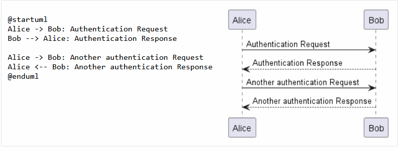

# Работа с PlantUML

## Диаграмма классов
структурная диаграмма языка моделирования UML, демонстрирующая общую структуру иерархии классов системы, их коопераций, атрибутов (полей), методов, интерфейсов и взаимосвязей (отношений) между ними. Широко применяется не только для документирования и визуализации, но также для конструирования посредством прямого или обратного проектирования. 

#### Взаимоссвязи между классами

### Синтаксис добавления методов и полей

### Указание видимости
Определяя методы и поля данных, вы можете использовать символы указания видимости, приведённые в таблице ниже: 

### Абстрактные и статические

Вы можете определить статические или абстрактные методы и поля данных используя модификаторы {static} и {abstract} соответственно.

Эти модификаторы могут располагаться как в начале, так и в конце строки. Вы так же можете использовать {classifier} как замену для {static}. 

## Диаграмма последовательнотей
UML-диаграмма, на которой для некоторого набора объектов на единой временной оси показан жизненный цикл объекта (создание-деятельность-уничтожение некой сущности) и взаимодействие акторов (действующих лиц) информационной системы.

Последовательность -> используется для передачи сообщения между двумя участниками . Участники не обязательно должны быть явно объявлены.

Чтобы иметь пунктирную стрелку, вы используете -->

Также можно использовать <- и <--. Это не меняет рисунок, но может улучшить читабельность. Обратите внимание, что это справедливо только для диаграмм последовательности, для других диаграмм правила другие.

### Объявление участников

При использовании ключевого слова participant возможно получить больший контроль над отображением участников.

Порядок перечисления участников задаёт также пороядок отображения участников по умолчанию.

Использование других ключевых слов (отличных от participant) позволяет изменить форму представления (отображения) участника:

* actor
* boundary
* control
* entity
* database
* collections
* queue

